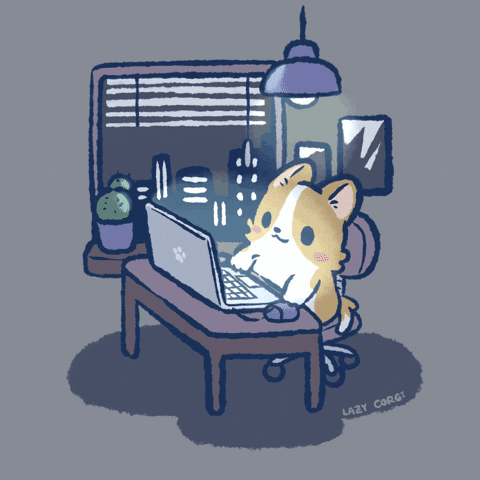

    

<h2>Hi there 👋</h2>

Info

* I'm 18 y.o.
* Student 👨‍🎓📚
* Backend and DevOps developer 👨‍💻
* <a href="https://github.com/coffee-proj">Coffee Project</a> member and co-owner

Skills

#### Languages

 

#### Databases and Brokers

   

#### DevOps

    

Сontact with me

 

