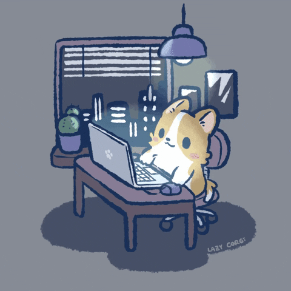
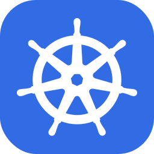

<h1 align="center">Hi, I'm Nikita 👋</h1>

    

Info

* I'm 17 y.o.
* Student 👨‍🎓📚
* Backend and DevOps developer 👨‍💻
* <a href="https://github.com/coffee-proj">Coffee Project</a> member and co-owner

Skills

### Languages

    
    

### Databases and Brokers

    
    
    

### DevOps

    
    

Сontact with me

    

